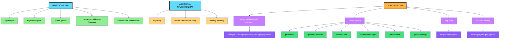

```mermaid
graph TD

    %% =====================================
    %% NAVIGATION BAR
    %% =====================================

    NAVBAR[NAVIGATION BAR]

    NAVBAR --> LOGIN["login /login"]
    NAVBAR --> REGISTER["register /register"]
    NAVBAR --> PROFILE["Profile /profile"]
    NAVBAR --> CATEGORY["category(dualRoute) /category"]
    NAVBAR --> NOTIFICATIONS["Notifications /notifications"]

    %% =====================================
    %% ADDITIONAL NAVIGATION BAR
    %% =====================================

    ADDNAV[ADDITIONAL NAVIGATION BAR]

    ADDNAV --> HELP["help /help"]
    ADDNAV --> CREATESHOP["create-shop /create-shop"]
    ADDNAV --> DELIVERY["delivery /delivery"]

    %% =====================================
    %% BRANCHED ROUTES
    %% =====================================

    BRANCHES[Branched Routes]

    BRANCHES --> CATEGORY_BRANCH["category(dualRoute) /category"]
    CATEGORY_BRANCH --> CATEGORY_DYNAMIC["/category/\${categoryTypeID}/\${categoryTypeSort}"]

    BRANCHES --> PROFILE_BRANCH["Profile /profile"]

    PROFILE_BRANCH --> PROFILE_ADS["/profile/ads"]
    PROFILE_BRANCH --> PROFILE_PURCHASES["/profile/purchases"]
    PROFILE_BRANCH --> PROFILE_SALES["/profile/sales"]
    PROFILE_BRANCH --> PROFILE_MESSAGES["/profile/messages"]
    PROFILE_BRANCH --> PROFILE_WALLET["/profile/wallet"]
    PROFILE_BRANCH --> PROFILE_SETTINGS["/profile/settings"]

    BRANCHES --> HELP_BRANCH["help /help"]
    HELP_BRANCH --> HELP_DYNAMIC["/help/\${helpTypeID}"]

    BRANCHES --> DELIVERY_BRANCH["delivery /delivery"]
    DELIVERY_BRANCH --> DELIVERY_DYNAMIC["/delivery/\${categoryTypeID}"]

    %% =====================================
    %% COLORS
    %% =====================================

    style NAVBAR fill:#61dafb,color:#000,stroke:#222,stroke-width:3px
    style ADDNAV fill:#61dafb,color:#000,stroke:#222,stroke-width:3px
    style BRANCHES fill:#ffb347,color:#000,stroke:#222,stroke-width:3px

    style LOGIN fill:#90ee90,color:#000
    style REGISTER fill:#90ee90,color:#000
    style PROFILE fill:#90ee90,color:#000
    style CATEGORY fill:#90ee90,color:#000
    style NOTIFICATIONS fill:#90ee90,color:#000

    style HELP fill:#ffd580,color:#000
    style CREATESHOP fill:#ffd580,color:#000
    style DELIVERY fill:#ffd580,color:#000

    style CATEGORY_BRANCH fill:#c77dff,color:#fff
    style PROFILE_BRANCH fill:#c77dff,color:#fff
    style HELP_BRANCH fill:#c77dff,color:#fff
    style DELIVERY_BRANCH fill:#c77dff,color:#fff

    style CATEGORY_DYNAMIC fill:#8b5cf6,color:#fff
    style HELP_DYNAMIC fill:#8b5cf6,color:#fff
    style DELIVERY_DYNAMIC fill:#8b5cf6,color:#fff

    style PROFILE_ADS fill:#4ade80,color:#000
    style PROFILE_PURCHASES fill:#4ade80,color:#000
    style PROFILE_SALES fill:#4ade80,color:#000
    style PROFILE_MESSAGES fill:#4ade80,color:#000
    style PROFILE_WALLET fill:#4ade80,color:#000
    style PROFILE_SETTINGS fill:#4ade80,color:#000
```
